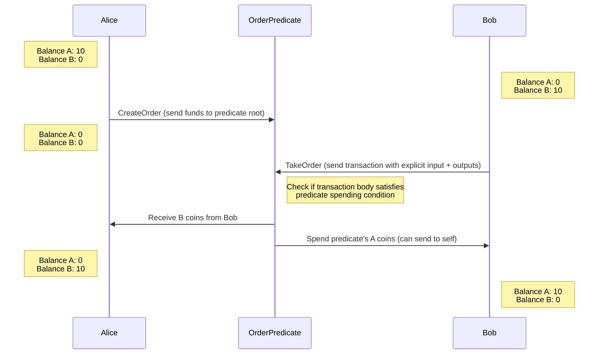

# Fuel Order Book powered by predicates

Demo of using predicates to orchestrate a swap without any smart contracts.
The counter-party discovery / order matching is out of scope.

## TODO

- [ ] figure out how to dynamically construct a predicate,
- [ ] frontend integration
- [ ] index the orders for market makers, UIs and takers

----

## What are predicates?

A predicate is a mechanism that allows someone to take ownership over an account by the nature of the
transaction input. To put funds behind a predicate you first need to figure out what the address is for
the predicate, this is done by generating a hash of the predicate bytecode. Then like any normal transfer,
a predicate is filled by sending coins to the hash of the bytecode. Then, in order to spend the predicate, any
user just needs to provide the predicate bytecode and construct a transaction that satisfies the conditions that
were set forward in the predicate code.

## How does this work for limit orders?

Note that predicates are not deployed to the chain. Rather, they are just a hash behind which some coins are locked.
if you can provide the bytecode that generates that hash AND have it evaluate to true, then ta-da you can spend it. This means that when creating an order, you just have to send coins to the code hash.
When executing the order, you just need the tx to make the predicate return true.
In the case of a limit order, the predicate just needs to make sure that the taker just sends enough coins to the maker
in order to have permissions to spend the predicate as they please. _Truly exciting stuff_

## Why is this better than other DEX architectures?

There are 2 predominant dex architecture strategies that have been put into production to date. The first, the uniswap
style AMM, is an AMM that does not require any off-chain services and is efficient enough to execute entirely in smart
contracts. There are several downsides to an AMM in terms of capital efficiency. The second DEX has been the off-chain order
book with on-chain settlement. This is the DYDX, 0x, OpenSea strategy. This architecture includes one off-chain component: the order book and one on-chain component: the settlement. Moving the order-book off-chain saves a ton of gas because you never need to store the orders on the expensive chain, BUT this has a centralized component, which is a target for regulation and has the downside of censorship and liveness problems.

The new architecture that is uniquely enabled by Fuel labs is a fully on-chain order book using predicates. In the case of predicates, there is no expensive writing to state problem because creating an order is just a simple transfer, as long as there is some data availability layer that allows the public to observe the orders that exists somewhere, they can fully be verified on chain by checking the balance of the predicate.

Predicate order book gets all the capital efficiency advantages of a CLOB and does not have to sacrifice on decentralization.

## The Tradeoff Space

| Exchange Type                    | Trustless | Censorship resistance | regulation resistant | capital efficient | Avoids state bloat |
| -------------------------------- | --------- | --------------------- | -------------------- | ----------------- | ------------------ |
| CEX                              | ❌         | ❌                     | ❌                    | ✅                 | N/A                |
| 0x/DyDx/opensea Style Order Book | ✅         | ❌                     | ❌                    | ✅                 | ✅                  |
| AMM                              | ✅         | ✅                     | ✅                    | ❌                 | ❌                  |
| Predicate Order Book             | ✅         | ✅                     | ✅                    | ✅                 | ✅                  |

## Possible but not yet implemented features

- partial order filling
- order cancellation
- expiry?
- more complex orders
  - NFT orders
  - RFQ orders
  - ... actually, the predicate is just code, so the complexity of these orders are really limitless. The only caveat is that they cannot reaaally be state dependant without some crazy state proof mechanism

## Illustration of the trade

